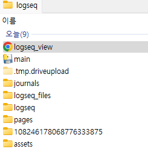

# Logseq_Viewer
 - Version : V0
 - Created by Daniel Park


### *Introduction*

I think Logseq is awesome free tool to manage todo lists or daily notes. However, It is hard to manage all tasks effectively if I only use Logseq. So, I decided to make a viewer program to visually manage all tasks written in Logseq. 


### *Concept*

Logseq Task Management Program to visualize task lists and their respective statuses


### *How to use?*

1. You must create logseq.json in the Logseq folder.



2. Input your Logseq folder address in the "Logseq_Address" in logseq.json

```json
{   
    "INFO" : {
        "Description":"Logseq setting file for execution",
        "Version": "Logseq Viewer V0",
        "Notice":"You must input Logseq folder directory. Otherwise the viewer file will not be created"
    },
    
    "SETTING":{
        "Logseq_Address" : "C:\\Users\\gnvid\\OneDrive\\바탕 화면\\logseq",
        "Mode":"RUN",
        "Style":"TBD",
        "Calander Range":"TBD"
    }
}
```

- Logseq_Address : Directory of Logseq folder
- Mode "RUN" : Create logseq_view.html automatically 

3. You can set debugging mode in the main.py file

``` Python
''' [DEVELOPER SETTING] '''

DEBUG_MODE=True # True : Debugging Mode
```

### *Function*
 - Visualization
 - Priority Filterin 
 - Calander Modification

